# Neural Image Style Transfer

## Vanilla Style Transfer

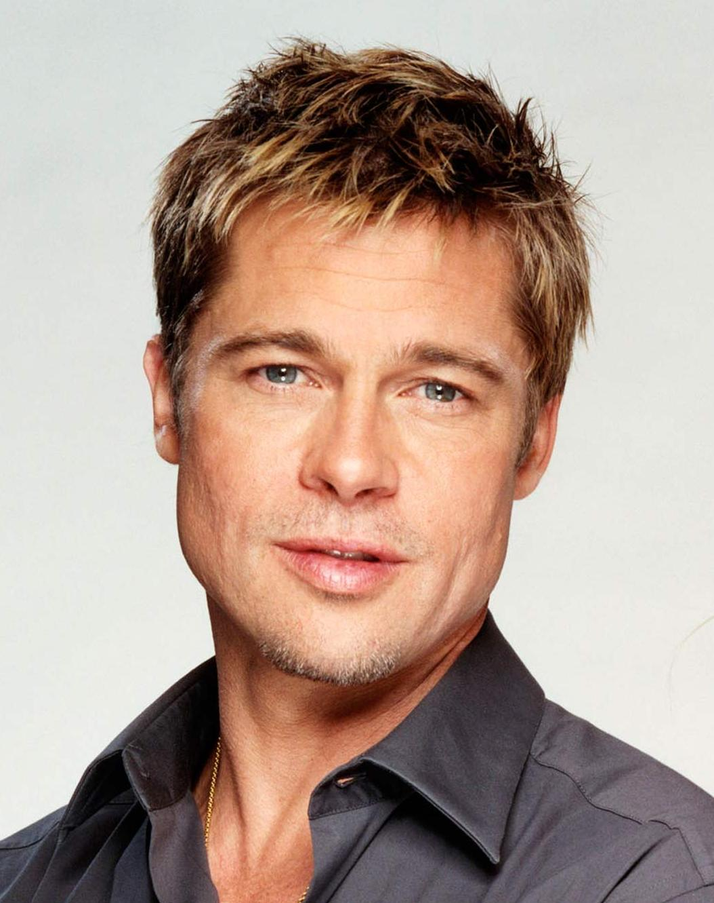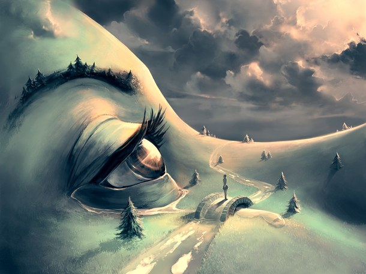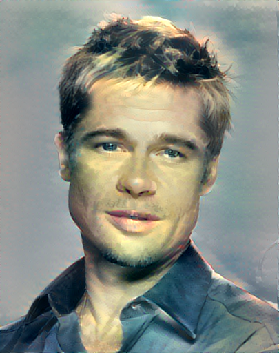

Artistic Neural Style transfer tries to transfer the stylistic details from one image onto the content of another image. This has a wide variety of applications in the domain of computer vision.

### Results

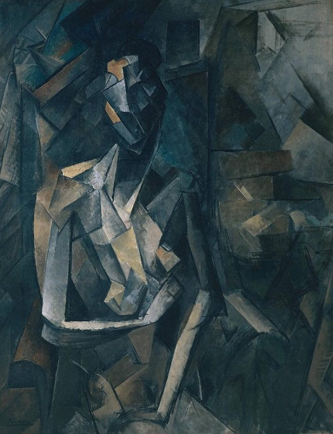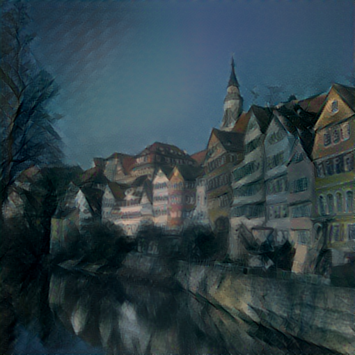

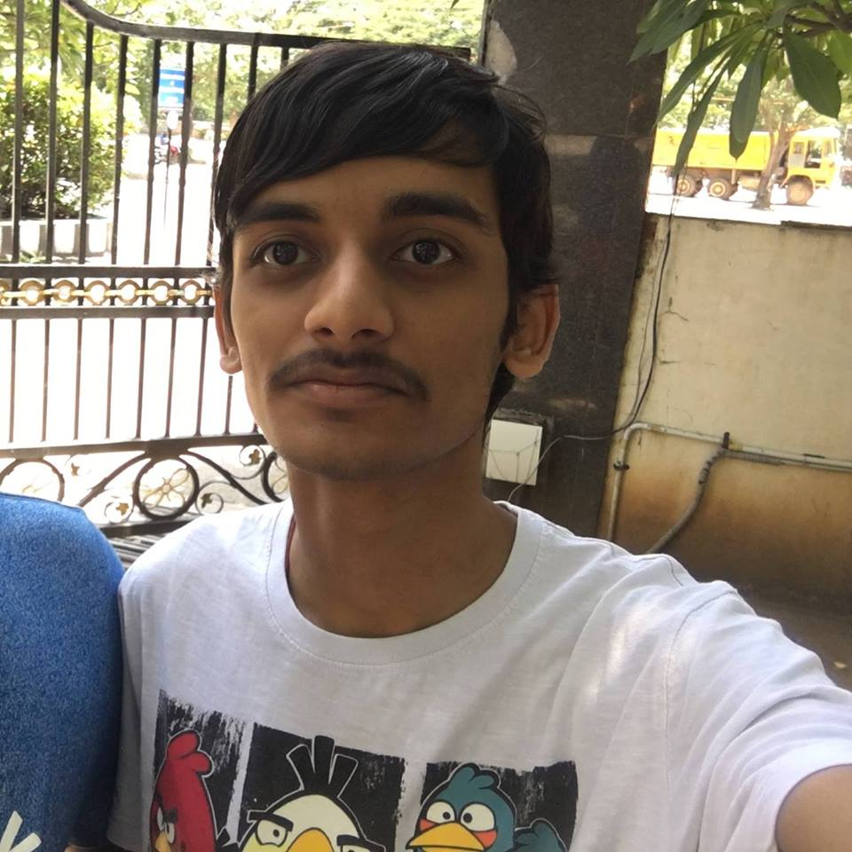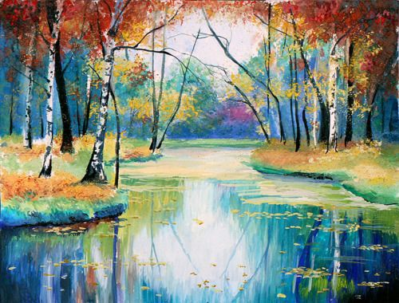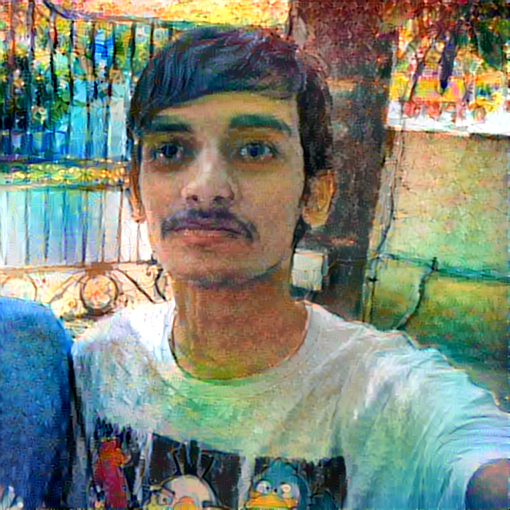

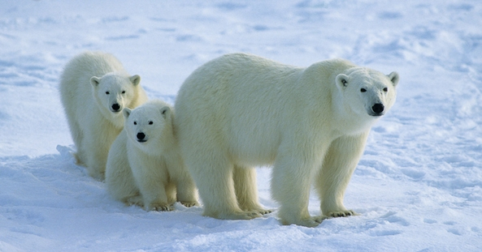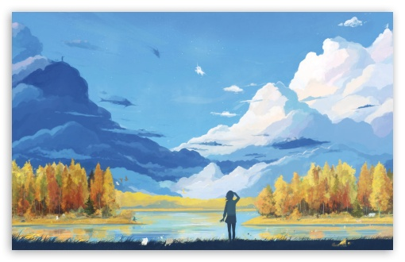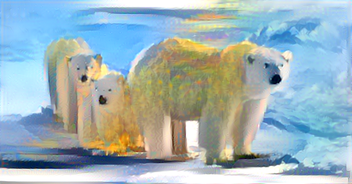

## Localized Style Transfer

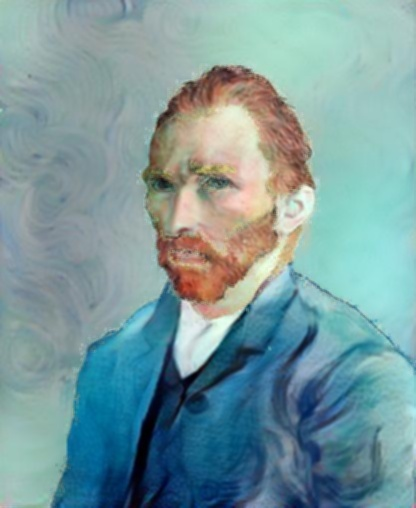

A lot of times, we are required to transfer the style of an image to the content which contains multiple objects placed at different locations, so there is no spatial alignment between the content and style images. To overcome this issue where vanilla style transfer does terrible, we introduce localized style transfer where image masks for the style and content are passed along as inputs as well. This supervision allows us to perform style transfer which gives us a much better quality of transfer.

### Results

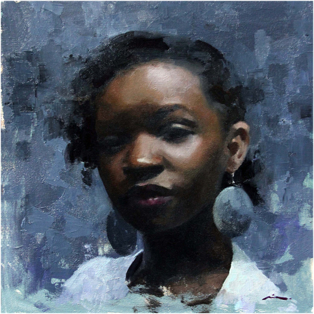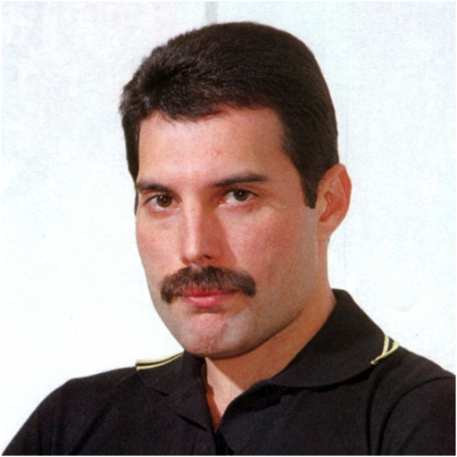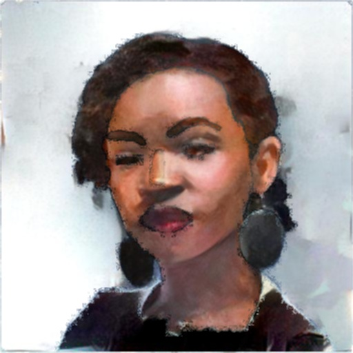

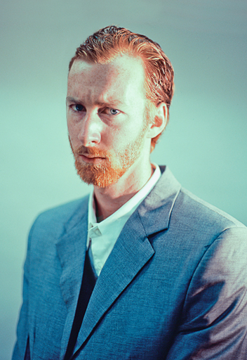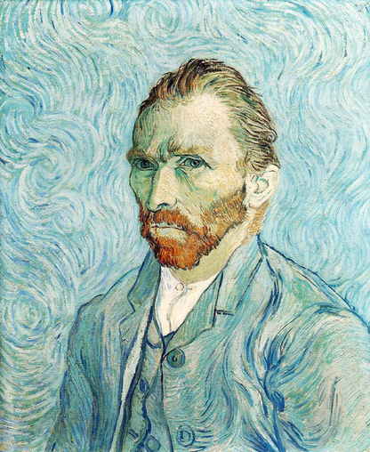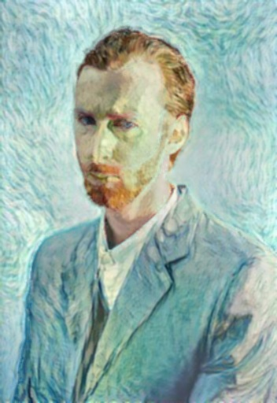

## Pyramid based Style Transfer

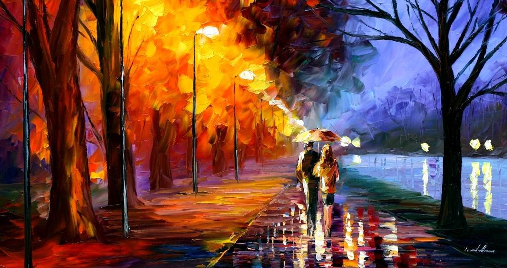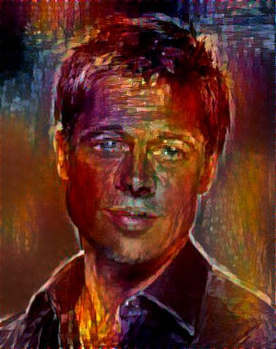

We have noticed that the content of an image is mainly depicted by the edges and to get a true 'style' only transfer, we would be required to get rid of the content color information completely. A few approaches towards this could be to us grayscale content images and to use a laplacian pyramid of content image at various points for the content loss modules. This method does not produce trememdously different results but gives us a lot more flexibility on the kinds of outputs we get. 

### Results

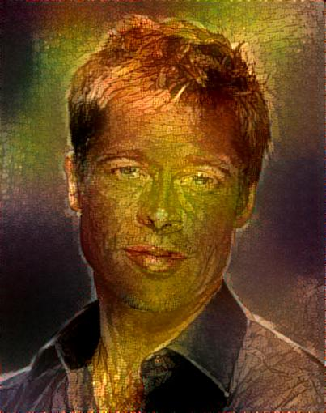

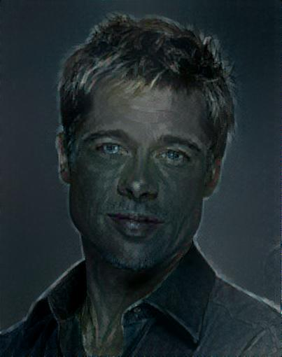

#### Note

A small article on the project and an extension to sketches: https://erilyth.wordpress.com/2016/11/05/neural-style-transfer-sketches/

Credits: jcjohnson's [Neural Style](https://github.com/jcjohnson/neural-style) and alexjc's [Neural Doodle](https://github.com/alexjc/neural-doodle) for sample image masks.
